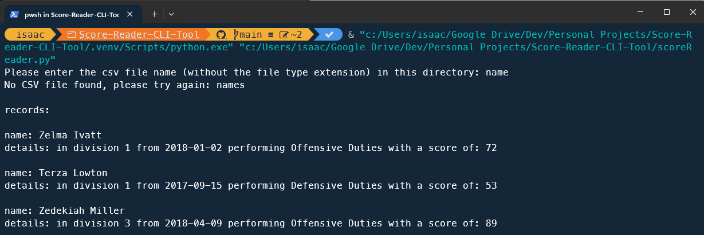

# Sports-Stats-CLI-Tool

## Description

This application is a CLI (command line interface) tool which reads a .csv file to sort data regarding a sports league with several divisions, points accrued and roles assigned to various players.

The application is built with Python using a Class based structure to assist with testing. When a valid .csv file is located based on the user's input, the contents of the file are sorted based on division in ascending order and score in descending order. Only the top three records are provided to improve clarity. 

The screenshot below shows how the application first prompts the user for a .csv file and then sorts the data within for the top three results:

## Table of Contents
            
- [Installation](#installation)
- [Usage](#usage)
- [License](#license)
- [Contributing](#contributing)
- [Tests](#tests)
- [Questions](#questions)
            
## Installation

To install this application, simply clone or download this repository to your local computer.
            
## Usage

Please ensure Python is downloaded and installed on your local machine. To install, visit the [official page here](https://www.python.org/downloads/).

1. Navigate to the cloned or downloaded folder in your terminal
2. Enter the following: & C:/Python312/python.exe *[CURRENT DIRECTORY]*/Name-Reader-CLI-Tool/scoreReader.py    

(NOTE: that you'll need to enter your full directory in the [CURRENT DIRECTORY] slot above. To find this, enter the "pwd" command in Unix-based systems or "cd" command without any arguments in Windows. Also, if Python is installed on another drive, you'll need to change the drive letter to replace the 'C:/' as shown above.)
            
## License
            
MIT License

Copyright (c) 2024 isaacfallon
            
Permission is hereby granted, free of charge, to any person obtaining a copy
of this software and associated documentation files (the "Software"), to deal
in the Software without restriction, including without limitation the rights
to use, copy, modify, merge, publish, distribute, sublicense, and/or sell
copies of the Software, and to permit persons to whom the Software is
furnished to do so, subject to the following conditions:
            
The above copyright notice and this permission notice shall be included in all
copies or substantial portions of the Software.
            
THE SOFTWARE IS PROVIDED "AS IS", WITHOUT WARRANTY OF ANY KIND, EXPRESS OR
IMPLIED, INCLUDING BUT NOT LIMITED TO THE WARRANTIES OF MERCHANTABILITY,
FITNESS FOR A PARTICULAR PURPOSE AND NONINFRINGEMENT. IN NO EVENT SHALL THE
AUTHORS OR COPYRIGHT HOLDERS BE LIABLE FOR ANY CLAIM, DAMAGES OR OTHER
LIABILITY, WHETHER IN AN ACTION OF CONTRACT, TORT OR OTHERWISE, ARISING FROM,
OUT OF OR IN CONNECTION WITH THE SOFTWARE OR THE USE OR OTHER DEALINGS IN THE
SOFTWARE.
            
## Contributing

N/A
            
## Tests

There is a testing suite set up in the 'tests.py' file with a class named: 'TestScoreReader'.

Run this file to test for .csv file validity. 

(NOTE: The testing is quite simplistic for the time being but with more time I would add additional tests to check for valid data within .csv files and further .csv file checking)
     
## Questions
            
If you have any questions, please reach out at either of the following:
            
### GitHub profile:
- https://github.com/isaacfallon

### Email:
- isaac.fallon@gmail.com
